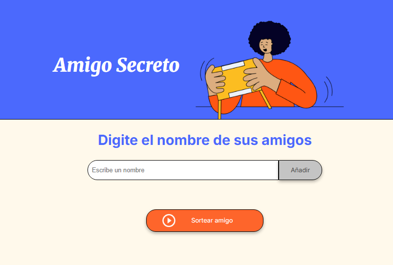
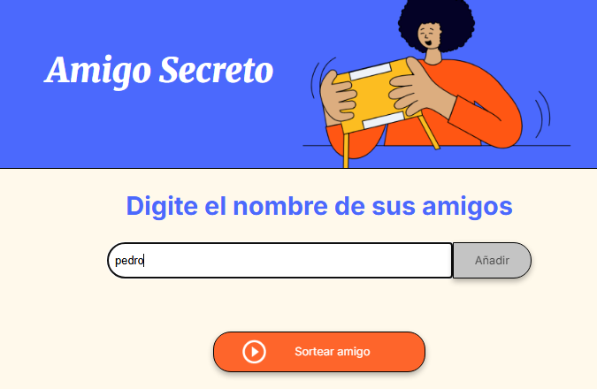
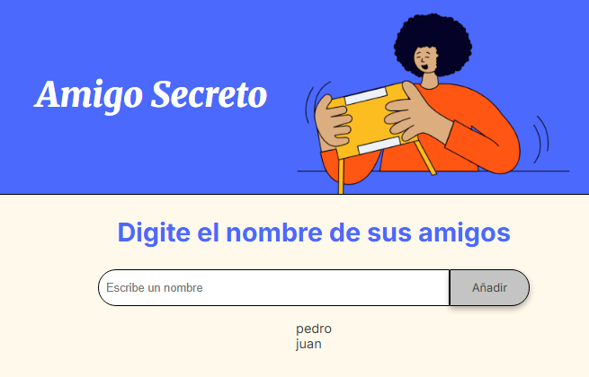
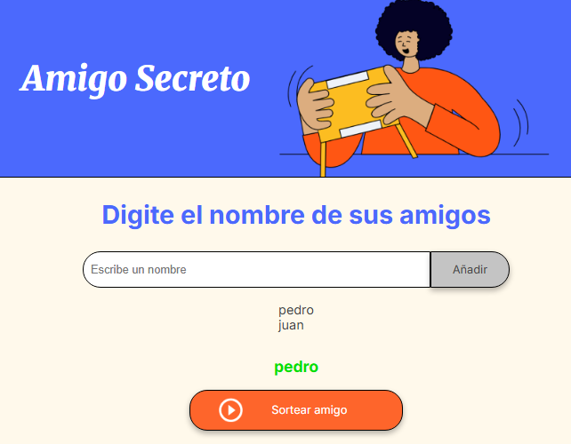
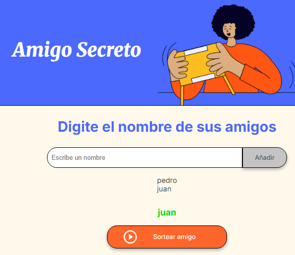

<h1>Registro del Challenge</h1>

- Estado del Challenge: Finalizado.
- Tecnologias utilizadas: Javascript, HTML, CSS, Visual Studio Code

# Manual de Uso del Juego Amigo Secreto

- El juego se muestra inicialmente de esta forma:

- Escriba un nombre en la casilla en blanco:

- Haga click en "añadir" y se guardará el nombre, imprimiendose en la pantalla y la casilla se pondrá nuevamente en blanco:

- Escriba un segundo nombre en la casilla en blanco y haga click en añadir:

- Haga click en sortear y aleatoriamiente saldrá un nombre en la pantalla:

- Nuevamente haga click en sortear y aleatoriamiente saldrá un nombre en la pantalla:

